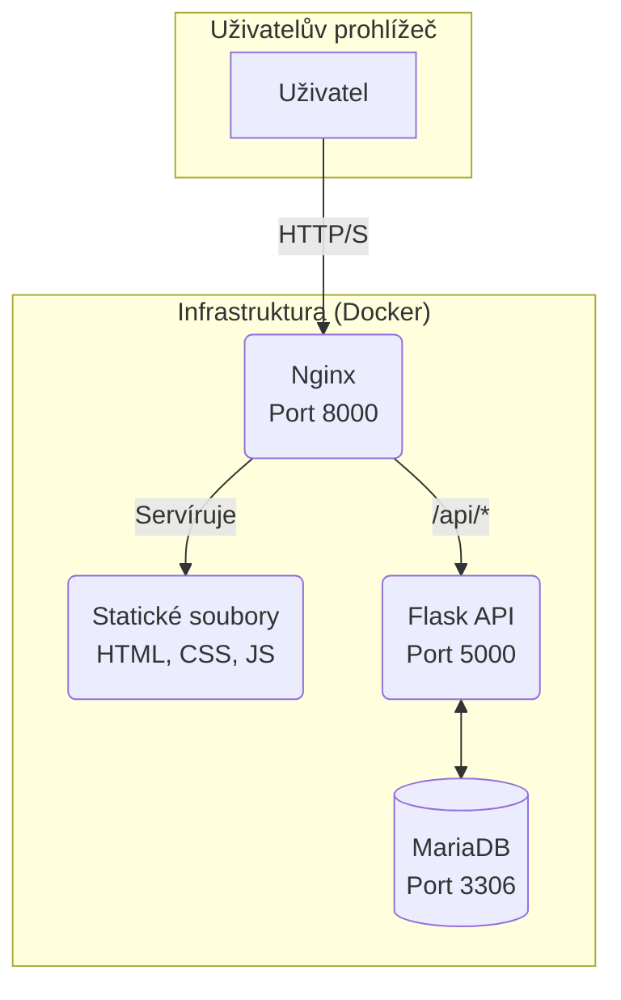
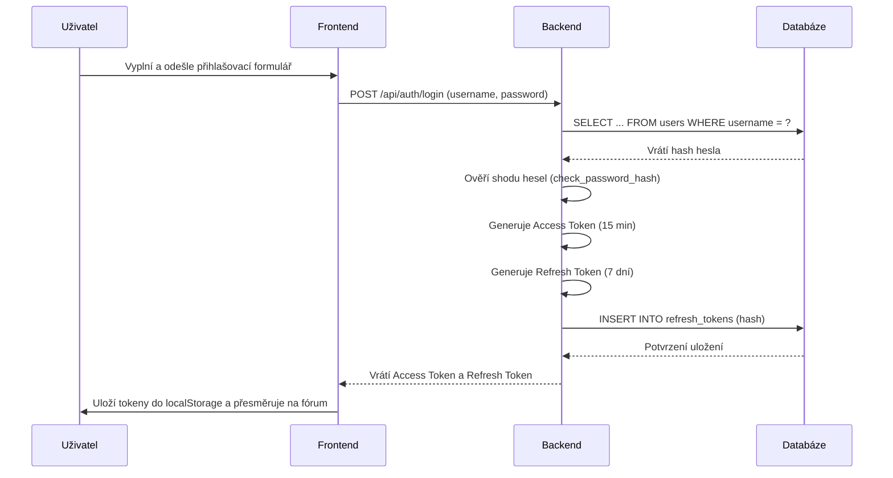
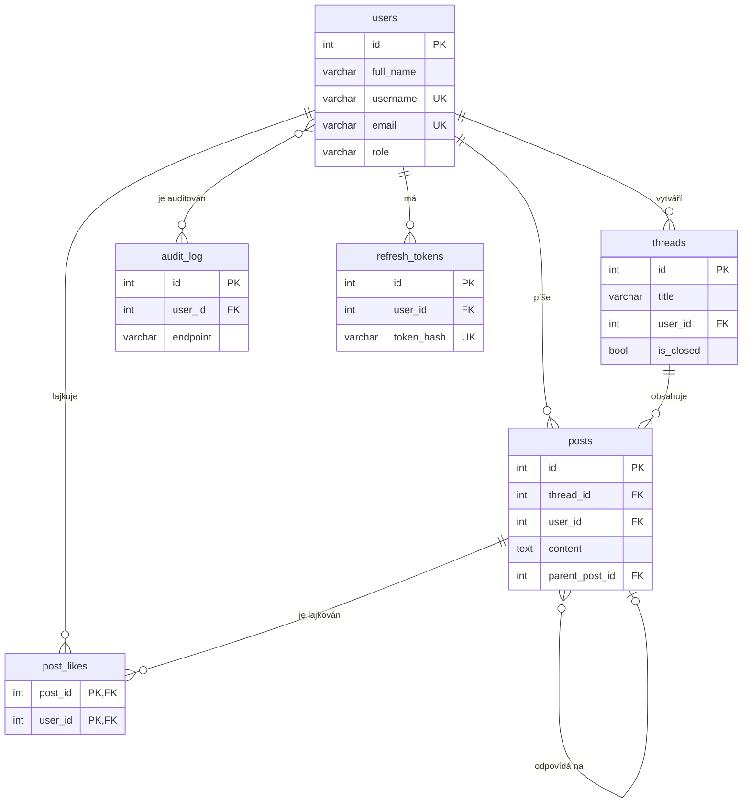

# Semestrální práce: Diskusní fórum pro veřejnou samosprávu

**Autoři:** Ferstl Matouš, Steinhauser Václav, Steinhauserová Janka, Vinczeová Barbora, Vacík Matyáš

**© 2025 ČZU v Praze**

---

## Obsah

1.  O projektu
    -   1.1. Idea a cíl
    -   1.2. Klíčové funkce
2.  Technologie a architektura
    -   2.1. Použité technologie
    -   2.2. Architektura aplikace
3.  Struktura projektu
4.  Instalace a spuštění
    -   4.1. Klonování repozitáře
    -   4.2. Spuštění aplikace
    -   4.3. Přístup k aplikaci
    -   4.4. Zastavení aplikace
5.  Realizace a popis komponent
    -   5.1. Frontend
    -   5.2. Backend
    -   5.3. Databázové schéma
6.  Uživatelské role a oprávnění
    -   6.1. Přehled rolí
    -   6.2. Pravomoci administrátora
7.  Dokumentace API
8.  Testování a analýzy
    -   8.1. Použitelnost
    -   8.2. Přístupnost (WAVE)
    -   8.3. Zpracování A/B testování
9.  Bezpečnostní aspekty
10. Nasazení do produkce
11. Možná vylepšení

---

## 1. O projektu

### 1.1. Idea a cíl

Cílem tohoto projektu je vytvořit moderní webovou platformu s názvem „Diskusní fórum pro veřejnou samosprávu“, která slouží jako komunikační prostor mezi občany, zaměstnanci samosprávy a představiteli města či obce. Tato platforma má umožnit otevřenou výměnu názorů, sběr podnětů a transparentní komunikaci o dění v obci nebo regionu. Je určena těm, kteří se chtějí aktivně zapojit do veřejného života a podílet se na zlepšování svého okolí.

Hlavní myšlenkou projektu je umožnit občanům snadno sdílet názory, upozorňovat na problémy ve veřejném prostoru a vyjadřovat se k tématům, která ovlivňují jejich každodenní život. Platforma umožňuje lidem zapojit se do diskusí, přidávat komentáře a otevírat nová témata, aniž by museli fyzicky navštěvovat úřady nebo veřejná zasedání. Zároveň poskytuje samosprávě možnost jednoduše a otevřeně komunikovat své kroky, informovat o připravovaných projektech a reagovat na dotazy občanů.

Tento projekt přináší samosprávě několik zásadních výhod. Občanům poskytuje snadno dostupné místo, kde mohou získat informace a zároveň vyjádřit své názory. Vedení obce získává přehled o potřebách obyvatel a může na ně rychle reagovat. Transparentnost, kterou platforma podporuje, posiluje důvěru veřejnosti a přispívá k otevřenějšímu a participativnímu rozhodování.

### 1.2. Klíčové funkce

- Registrace a přihlašování uživatelů s různými rolemi (občan, politik, admin).
- Vytváření, správa a moderování diskusních vláken.
- Přidávání příspěvků, odpovědí a udělování "lajků".
- Anonymní publikování příspěvků.
- Administrátorské rozhraní pro správu uživatelů a obsahu.
- Auditní záznamy pro sledování důležitých akcí.

---

## 2. Technologie a architektura

### 2.1. Použité technologie

Aplikace je postavena na kontejnerizované architektuře s odděleným frontendem a backendem.

-   **Backend:** Python, Flask, JWT (JSON Web Tokens)
-   **Frontend:** HTML5, Bootstrap 5, Vanilla JavaScript (ES6+)
-   **Databáze:** MariaDB
-   **Infrastruktura:** Docker, Docker Compose, Nginx

### 2.2. Architektura aplikace

Projekt využívá vícevrstvou architekturu, kde je každá část zodpovědná za specifickou funkci. Komunikace mezi službami probíhá v rámci interní sítě, kterou spravuje Docker.



1.  **Uživatel** přistupuje k aplikaci přes webový prohlížeč na portu `8000`.
2.  **Nginx** funguje jako vstupní brána. Přijímá všechny požadavky.
    -   Pokud požadavek směřuje na statické soubory (`/`, `*.html`, `*.css`, `*.js`), Nginx je servíruje z adresáře `frontend`.
    -   Pokud požadavek směřuje na cestu začínající `/api/`, Nginx jej přesměruje (proxy) na backendovou Flask aplikaci.
3.  **Backend (Flask)** zpracovává veškerou aplikační logiku – autentizaci, práci s daty, oprávnění.
4.  **Databáze (MariaDB)** slouží k perzistentnímu ukládání všech dat. Backend je jediná služba, která s databází přímo komunikuje.

---

## 3. Struktura projektu

```
/
├── backend/              # Zdrojové kódy backendové Flask aplikace
│   ├── app.py            # Hlavní soubor aplikace
│   └── Dockerfile        # Instrukce pro sestavení Docker image
├── frontend/             # Statické soubory frontendu (HTML, CSS, JS)
├── nginx/                # Konfigurace pro Nginx
├── docker-compose.yml    # Definuje a spouští všechny služby aplikace
├── init.sql              # SQL skript pro inicializaci databázového schématu (v kontejneru jako schema.sql)
└── README.md             # Tato dokumentace
```

---

## 4. Instalace a spuštění

Pro spuštění projektu lokálně je nutné mít nainstalovaný **Docker** a **Docker Compose**.

### 4.1. Klonování repozitáře

```sh
git clone <URL_REPOZITÁŘE>
cd <NÁZEV_PROJEKTU>
```

### 4.2. Spuštění aplikace

V kořenovém adresáři projektu spusťte všechny služby pomocí Docker Compose:

```bash
docker-compose up --build -d
```

-   `--build`: Vynutí sestavení Docker obrazů (potřebné při první spuštění nebo po změně v `Dockerfile`).
-   `-d`: Spustí kontejnery na pozadí (detached mode).

### 4.3. Přístup k aplikaci

Po úspěšném spuštění jsou jednotlivé služby dostupné na následujících portech na vašem `localhost`:

-   **Frontend aplikace:** `http://localhost:8000`
-   **Backend API:** `http://localhost:5000`
-   **Databáze (MariaDB):** `localhost:3306` (pro připojení z externího klienta)

#### Detailní popis přístupu přes Nginx

Když v prohlížeči zadáte adresu `http://localhost:8000`, požadavek zpracuje Nginx server. Jeho chování je definováno v souboru `nginx/nginx.conf` a funguje následovně:

1.  **Požadavek na stránku (např. `/forum.html`):**
    -   Nginx zjistí, že cesta nezačíná na `/api/`.
    -   Vyhledá soubor v kořenovém adresáři `/var/www/html` (kam je namapován lokální adresář `./frontend/`).
    -   Najde soubor `forum.html` a pošle jeho obsah zpět do prohlížeče. Stejný princip platí pro všechny `.css` a `.js` soubory.

2.  **Požadavek na API (např. `/api/threads`):**
    -   Nginx detekuje, že cesta začíná na `/api/`.
    -   Aktivuje se pravidlo `location /api/`.
    -   Nginx požadavek nepřesměruje, ale funguje jako **reverzní proxy**: vezme původní požadavek a pošle ho na interní adresu `http://backend:5000/api/threads`. `backend` je název služby definovaný v `docker-compose.yml`, který Docker automaticky přeloží na správnou IP adresu kontejneru.
    -   Odpověď od Flask aplikace pak Nginx pošle zpět do prohlížeče.

Tento mechanismus elegantně odděluje frontend od backendu a umožňuje jim běžet jako samostatné služby, přičemž z pohledu uživatele se vše tváří jako jedna aplikace na jedné adrese.

### 4.4. Zastavení aplikace

Pro zastavení a odstranění kontejnerů použijte příkaz:

```bash
docker-compose down
```

---

## 5. Realizace a popis komponent

### 5.1. Frontend

Front-end je postaven na HTML5, CSS frameworku Bootstrap 5 a Vanilla JavaScriptu (ES6+). Komunikace s backendem probíhá asynchronně pomocí `fetch` API, což umožňuje plynulé načítání dat bez znovunačítání stránky.

#### Klíčové skripty

-   **`js/api.js` (Komunikační vrstva):** Centrální funkce `apiRequest` zapouzdřuje veškerou komunikaci s backendem, včetně automatické správy a obnovy JWT tokenů.
-   **`js/auth.js` (Logika pro přihlášení/registraci):** Skripty pro přihlašovací (`login.html`) a registrační (`register.html`) stránky zpracovávají formuláře a po úspěšném přihlášení ukládají tokeny do `localStorage`.
-   **`js/forum.js` (Srdce aplikace):** Hlavní skript pro logiku fóra. Zodpovídá za načítání a vykreslování vláken, příspěvků a zpracování uživatelských interakcí (přidání příspěvku, mazání, lajkování). Využívá `history.replaceState` pro dynamickou změnu URL, což umožňuje sdílení odkazů na konkrétní vlákna.
-   **`js/admin.js` (Administrace):** Zajišťuje funkčnost stránky pro správu uživatelů a nastavení aplikace.
-   **`js/profile.js` (Uživatelský profil):** Umožňuje uživateli upravit své údaje a změnit heslo.

#### Ošetření chybových hlášení

Pro zobrazení chybových a informačních hlášení se v současné verzi používá standardní JavaScriptová funkce `alert()`.

### 5.2. Backend

Backend je monolitická Flask aplikace, která poskytuje RESTful API a je zodpovědná za veškerou aplikační logiku.

#### Klíčové vlastnosti

-   **Konfigurace:** Aplikace se konfiguruje primárně pomocí **proměnných prostředí** z `docker-compose.yml`. Při startu se navíc z databáze načítají dynamická nastavení (např. pravidla pro hesla), která mohou administrátoři měnit za běhu.
-   **Autentizace (JWT):** Používá se dvoutokenový systém pro bezpečné a perzistentní přihlášení.
    -   **Access Token:** Krátkodobý (15 minut), přikládá se ke každému API požadavku.
    -   **Refresh Token:** Dlouhodobý (7 dní), slouží k získání nového access tokenu bez nutnosti opětovného zadávání hesla.
-   **Autorizace:** Dekorátor `@token_required` chrání citlivé endpointy a ověřuje roli uživatele.
-   **Zpracování dat:** Využívá se "měkké mazání" (soft delete), kdy se záznamy nemažou fyzicky, ale pouze označují jako smazané. Vnořené příspěvky se sestavují do stromové struktury na straně serveru pro vyšší efektivitu.
-   **Auditní logování:** Dekorátor `@app.after_request` automaticky zaznamenává informace o každém API požadavku do databáze pro bezpečnostní účely.

#### Diagram: Autentizační tok (Login)



#### Detailní popis logiky (`app.py`)

-   **Autentizační a autorizační logika:**
    -   **Registrace a přihlášení:** Standardní endpointy `/register` a `/login`. Hesla se nikdy neukládají v čistém textu, používá se hashování pomocí `werkzeug.security.generate_password_hash`.
    -   **JWT (JSON Web Tokens):** Pro autorizaci se používá dvoutokenový systém:
        -   **Access Token:** Krátkodobý (15 minut), obsahuje `user_id` a `role`. Přikládá se ke každému chráněnému API požadavku.
        -   **Refresh Token:** Dlouhodobý (7 dní), bezpečně uložený na straně klienta. Slouží k získání nového access tokenu bez nutnosti opětovného zadávání hesla. Jeho hash je uložen v databázi pro možnost zneplatnění.
    -   **Dekorátor `@token_required`:** Tento Python dekorátor "obaluje" všechny chráněné endpointy. Automaticky ověřuje platnost access tokenu z `Authorization` hlavičky a předává informace o uživateli do dané funkce. Tím se centralizuje a zjednodušuje kontrola oprávnění.
-   **Zpracování dat (CRUD operace):**
    -   Endpointy pro vlákna (`/threads`) a příspěvky (`/posts`) implementují standardní CRUD operace (Create, Read, Update, Delete).
    -   **Měkké mazání (Soft Delete):** Místo fyzického mazání záznamů z databáze se u vláken a příspěvků pouze nastavuje příznak `is_deleted = TRUE`. To zachovává integritu dat (např. odpovědi na smazaný příspěvek) a umožňuje případnou obnovu.
    -   **Vnořené příspěvky:** Při načítání detailu vlákna se všechny příspěvky načtou najednou a následně se v Pythonu sestaví do stromové struktury na základě `parent_post_id`. To je efektivnější než provádět rekurzivní dotazy do databáze.

### 5.3. Databázové schéma

Databáze je navržena s důrazem na relační integritu. Skript `init.sql` definuje následující klíčové tabulky:

-   **`users`**: Informace o uživatelích, včetně role a stavu (schválený, blokovaný).
-   **`threads`**: Hlavní diskusní vlákna.
-   **`posts`**: Jednotlivé příspěvky s možností vnořování (`parent_post_id`).
-   **`post_likes`**: Spojovací tabulka pro "lajky".
-   **`audit_log`**: Záznamy o všech API požadavcích.
-   **`settings`**: Klíč-hodnota úložiště pro globální nastavení aplikace.

Další tabulky jako `refresh_tokens`, `password_reset_tokens` a `post_likes` slouží pro specifické funkce jako je obnova sezení, reset hesla a správa "lajků".

#### Diagram: Databázové schéma (ERD)



Všechny vazby využívají cizí klíče s pravidly `ON DELETE CASCADE` nebo `ON DELETE SET NULL` pro zachování konzistence dat.

---

## 6. Uživatelské role a oprávnění

Aplikace využívá systém rolí pro řízení přístupu k různým funkcím.

### 6.1. Přehled rolí

-   **`user` (Občan):** Základní role. Může zakládat vlákna, přispívat, lajkovat a spravovat svůj profil.
-   **`politician` (Politik):** Má stejná oprávnění jako `user`, ale jeho příspěvky jsou vizuálně odlišeny.
-   **`admin` (Administrátor):** Má nejvyšší oprávnění a dohlíží na chod fóra.

### 6.2. Pravomoci administrátora

Uživatel s rolí `admin` má přístup ke speciální sekci (`admin.html`) a může:
-   **Spravovat uživatele:** Měnit role, blokovat účty, schvalovat registrace.
-   **Spravovat obsah:** Mazat a uzavírat jakékoliv vlákno nebo příspěvek.
-   **Spravovat nastavení:** Měnit globální parametry aplikace (např. složitost hesla).
-   **Prohlížet auditní záznamy:** Má přístup k logům všech operací v systému.

---

## 7. Dokumentace API

Backend poskytuje RESTful API. Všechny chráněné požadavky vyžadují `Authorization: Bearer <token>` hlavičku.

-   **Autentizace (`/api/auth/*`):**
-   `POST /register`: Registrace nového uživatele.
-   `POST /login`: Přihlášení, vrací access a refresh token.
-   `POST /refresh`: Získání nového access tokenu pomocí refresh tokenu.
-   `POST /logout`: Placeholder pro odhlášení. Logika odhlášení (smazání tokenů) probíhá na straně klienta.
-   `POST /forgot-password`: Odeslání e-mailu pro obnovu hesla.
-   `POST /reset-password`: Nastavení nového hesla s platným tokenem.
-   `GET /password-policy`: Veřejný endpoint vracející pravidla pro hesla.

-   **Vlákna (`/api/threads`):**
    -   `GET /`: Seznam všech vláken.
    -   `POST /`: Vytvoření nového vlákna.
    -   `GET /<id>`: Detail vlákna s příspěvky.
-   `PUT /<id>`: Aktualizace názvu vlákna.
    -   `DELETE /<id>`: Smazání vlákna.
    -   `PUT /<id>/close`: Uzavření/otevření vlákna.

-   **Příspěvky (`/api/posts`):**
    -   `POST /threads/<id>/posts`: Přidání příspěvku do vlákna.
-   `PUT /<id>`: Aktualizace obsahu příspěvku.
    -   `DELETE /<id>`: Smazání příspěvku.
    -   `POST /<id>/like`: Přidání/odebrání "lajku".

-   **Profil (`/api/profile`, `/api/users/*`):**
    -   `GET /profile`: Získání dat přihlášeného uživatele.
    -   `PUT /profile`: Aktualizace dat přihlášeného uživatele.
    -   `PUT /users/change_password`: Změna hesla přihlášeného uživatele.

-   **Administrace (`/api/admin/*`):**
    -   Endpointy pro správu uživatelů (získání seznamu, změna role, blokace, schválení, smazání), správu nastavení a prohlížení auditních záznamů.

---

## 8. Testování a analýzy

### 8.1. Použitelnost

Použitelnost byla klíčovým faktorem při návrhu. Cílem bylo vytvořit systém, který je intuitivní a snadno ovladatelný pro občany různého věku a technické zdatnosti. Důraz byl kladen na jednoduchost, přehlednost, okamžitou zpětnou vazbu a konzistenci rozhraní.

### 8.2. Přístupnost (WAVE)

Pro analýzu přístupnosti byl použit automatizovaný nástroj **WAVE (Web Accessibility Evaluation Tool)**. Po opravě počátečních nedostatků (např. chybějící popisky formulářů) prošla aplikace testem s **0 chybami**, což potvrzuje splnění základních technických požadavků na přístupnost (WCAG).

---

## 9. Bezpečnostní aspekty

-   **Autentizace a autorizace:** Použití JWT s krátkodobými access tokeny a dlouhodobými refresh tokeny. Role uživatelů jsou ověřovány na straně serveru.
-   **Ochrana hesel:** Hesla jsou hashována pomocí silného algoritmu (Scrypt).
-   **Ochrana proti SQL Injection:** Použitím parametrizovaných dotazů v knihovně `flask-mysqldb` je aplikace chráněna proti útokům.
-   **CORS (Cross-Origin Resource Sharing):** Backendová aplikace povoluje požadavky ze všech zdrojů (domén), což je nezbytné pro komunikaci s frontendem běžícím na jiném portu během lokálního vývoje.
-   **Auditní záznamy:** Podrobné logování všech API požadavků umožňuje zpětně analyzovat podezřelou aktivitu.
-   **Správa secretů:** Citlivé údaje (hesla k DB, `SECRET_KEY`) jsou spravovány jako proměnné prostředí a nejsou součástí kódu.

---

## 10. Konfigurace SMTP pro odesílání e-mailů

Backendová aplikace vyžaduje pro odesílání e-mailů (např. při registraci nebo obnově hesla) konfiguraci SMTP serveru. Nastavení se provádí pomocí proměnných prostředí v `docker-compose.yml` pro službu `backend`.

```yaml
# Příklad v docker-compose.yml
services:
  backend:
    environment:
      # ... ostatní proměnné
      MAIL_SERVER: "smtp.example.com"
      MAIL_PORT: 587
      MAIL_USE_TLS: "true"
      MAIL_USERNAME: "your-email@example.com"
      MAIL_PASSWORD: "your-email-password"
```

Pro lokální vývoj lze použít nástroje jako Mailtrap nebo testovací SMTP server vašeho poskytovatele e-mailu.